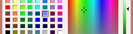

ofxWinUtils
===========



Usefull Windows Utils implementation for openFrameworks - `v0.0.2`

Installation
------------
To use ofxWinUtils, first you need to download and install [openFrameworks](https://github.com/openframeworks/openFrameworks).

To get a copy of the repository you can download the source from [GitHub](https://github.com/LeoColomb/ofxWinUtils) or, alternatively, you can use `git clone`:
```bash
git clone git://github.com/LeoColomb/ofxWinUtils.git
```
The addon should sit in `openFrameworks/addons/ofxWinUtils/`.

Usage
-----
### `ofxWinColorDialog`
```cpp
ofColor myColor = ofxWinColorDialog();
```